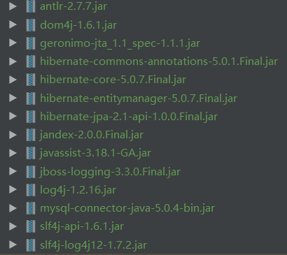
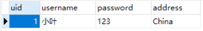
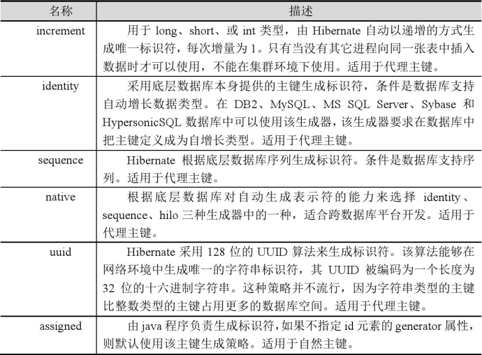

# Hibernate学习笔记

## 一、Hibernate简介

Hibernate是一个开放源代码的对象关系映射框架，它对JDBC进行了非常轻量级的对象封装，它将POJO与数据库表建立映射关系，是一个全自动的orm框架，hibernate可以自动生成SQL语句，自动执行，使得Java程序员可以随心所欲的使用对象编程思维来操纵数据库。

Hibernate就是一个持久层的ORM（Object Relational Mapping，对象关系映射）框架。

## 二、ORM思想（简单理解）

（1）让实体类首先和数据库表一一对应

​		  让实体类属性 和 表里面字段一一对应

（2）不需要直接操作数据库表，而操作表对应实体类对象

## 三、Hibernate入门

### 一、导入jar包



### 二、创建实体类

```java
public class User {
    private int uid;
    private String username;
    private String password;
    private String address;

    public int getUid() {
        return uid;
    }

    public void setUid(int uid) {
        this.uid = uid;
    }

    public String getUsername() {
        return username;
    }

    public void setUsername(String username) {
        this.username = username;
    }

    public String getPassword() {
        return password;
    }

    public void setPassword(String password) {
        this.password = password;
    }

    public String getAddress() {
        return address;
    }

    public void setAddress(String address) {
        this.address = address;
    }
}

```

### 三、创建配置文件

#### 一、配置实体类和数据库表一一对应关系（映射关系）

在实体类包下创建一个名为“实体类类名.hbm.xml”的xml文件（文件名和文件的路径不一定要这样，只是建议），在该xml文件中：

```xml
<?xml version="1.0" encoding="UTF-8" ?>
<!DOCTYPE hibernate-mapping PUBLIC
        "-//Hibernate/Hibernate Mapping DTD 3.0//EN"
        "http://www.hibernate.org/dtd/hibernate-mapping-3.0.dtd">
<hibernate-mapping>
    <!-- class标签
		name属性：实体类全路径
		table属性：数据库表名称
	-->
    <class name="com.yyh.entity.User" table="t_user">
        <!-- id标签
			name属性：实体类里面id属性名称，唯一
			column属性：生成的表字段名称，唯一
		 -->
        <id name="uid" column="uid">
            <!-- 设置数据库表id增长策略 
				native:生成表id值就是主键自动增长
			-->
            <generator class="native"></generator>
        </id>
        <!-- 配置其他属性和表字段对应 
			name属性：实体类属性名称
			column属性：生成表字段名称
		-->
        <property name="username" column="username"></property>
        <property name="password" column="password"></property>
        <property name="address" column="address"></property>
    </class>
</hibernate-mapping>
```

#### 二、创建Hibernate核心配置文件

在项目的src下创建一个名为“hibernate.cfg.xml"的xml文件（文件名和文件路径固定），在该xml文件：

```xml
<?xml version="1.0" encoding="UTF-8" ?>
<!DOCTYPE hibernate-configuration PUBLIC
        "-//Hibernate/Hibernate Configuration DTD 3.0//EN"
        "http://www.hibernate.org/dtd/hibernate-configuration-3.0.dtd">
<hibernate-configuration>
    <session-factory>
        <property name="hibernate.connection.driver_class">com.mysql.jdbc.Driver</property>
        <property name="hibernate.connection.url">jdbc:mysql:///hibernate</property>
        <property name="hibernate.connection.username">root</property>
        <property name="hibernate.connection.password">123456</property>

        <property name="hibernate.show_sql">true</property>
        <property name="hibernate.format_sql">true</property>
        <property name="hibernate.hbm2ddl.auto">update</property>
        <property name="hibernate.dialect">org.hibernate.dialect.MySQLDialect</property>

        <mapping resource="com/yyh/entity/User.hbm.xml"></mapping>
        
    </session-factory>
</hibernate-configuration>
```

### 四、实现一个简单的添加操作

```java
	@Test
	public void simpleAdd() {
//		第一步 加载hibernate核心配置文件
		// 到src下面找到名称是hibernate.cfg.xml
		//在hibernate里面封装对象
		Configuration cfg = new Configuration();
		cfg.configure();
		
//		第二步 创建SessionFactory对象
		//读取hibernate核心配置文件内容，创建sessionFactory
		//在过程中，根据映射关系，在配置数据库里面把表创建
		SessionFactory sessionFactory = cfg.buildSessionFactory();
		
//		第三步 使用SessionFactory创建session对象
		// 类似于连接
		Session session = sessionFactory.openSession();
		
//		第四步 开启事务
		Transaction tx = session.beginTransaction();

//		第五步 写具体逻辑 crud操作
		//添加功能
		User user = new User();
		user.setUsername("小叶");
		user.setPassword("123");
		user.setAddress("China");
		//调用session的方法实现添加
		session.save(user);
		
//		第六步 提交事务
		tx.commit();

//		第七步 关闭资源
		session.close();
		sessionFactory.close();
	}

```

### 五、运行结果




## 四、Hibernate几个核心类

#### 一、Configuration

```java
Configuration cfg = new Configuration();
cfg.configure();
```

到src下面找到名称hibernate.cfg.xml配置文件，创建对象，把配置文件放到对象里面

#### 二、SessionFactory

（1）使用Configuration对象创建SessionFactory对象，创建Sessionfactory过程时，根据核心配置文件中，有数据库配置，有映射文件部分，到数据库里面根据映射关系把表创建

（2）创建SessionFactory过程中，这个过程特别耗资源，在Hibernate操作中，建议一个项目一般创建一个sessionFactory对象

编写工具类：

```java
public class HibernateUtils {

    static Configuration cfg = null;
    static SessionFactory sessionFactory = null;

    static{
        cfg = new Configuration();
        cfg.configure();
        sessionFactory = cfg.buildSessionFactory();
    }

    public static SessionFactory getSessionFactory(){
        return sessionFactory;
    }
}

```

#### 三、Session

1 、Session对象类似于jdbc中Connection对象

2 、调用Session里面不同的方法实现crud操作

（1）添加 save方法

（2）修改 update方法

（3）删除 delete方法

（4）根据id查询 get方法

3 、Session对象是单线程对象

（1）Session对象不能共用，只能自己使用

#### 四、Transaction

事务的四个特性：原子性、一致性、隔离性、持久性

## 五、实体类编写规则

1 、实体类里面属性私有的

2 、私有属性使用公开的set和get方法操作

3、 要求实体类有属性作为唯一值（一般使用id值）

4 、实体类属性建议不使用基本数据类型，而使用基本数据类型对应的包装类

| 基本数据类型 | 对应的包装类 |
| ------------ | ------------ |
| int          | Integer      |
| char         | Character    |
| boolean      | Boolean      |
| float        | Float        |
| double       | Double       |
| short        | Short        |
| long         | Long         |
| byte         | Byte         |

## 六、Hibernate主键生成策略

Hibernate要求实体类里面有一个属性作为唯一值，对应表的主键，主键可以有不同的生成策略，



## 七、CRUD操作

### 一、添加

```java
User user = new User();
user.setUsername("小刘");
user.setPassword("111");
user.setAddress("Japan");

session.save(user);
```

### 二、根据id查询

```java
User user = session.get(User.class,1);
```

### 三、修改

```java
User user = session.get(User.class,1);
user.setUsername("小王");
        
session.update(user);
```

### 四、删除

```java
User user = session.get(User.class,1);

session.delete(user);
```

## 八、实体类对象状态

1、瞬时态（对象里面没有id值，对象与session没有关联）

```java
User user = new User();
user.setUsername("小刘");
user.setPassword("111");
user.setAddress("Japan");
```

2、持久态（对象里面有id值，对象与session关联）

```java
User user = session.get(User.class,1);
```

3、托管态（对象有id值，对象与session没有关联）

```java
User user = new User();
user.setId(1);
```

**注**：

saveOrUpdate方法在实体类为瞬时态时做添加操作，托管态和持久态时做修改操作

## 九、Hibernate缓存

### 一、Hibernate缓存特点

#### 一、Hibernate的一级缓存

(1）Hibernate的一级缓存默认打开的

(2）Hibernate的一级缓存使用范围，是Session范围，从Session创建到Session关闭范围

(3）Hibernate的一级缓存中，存储数据必须 持久态数据

***Hibernate一级缓存特性：持久态自动更新数据库***

#### 二、Hibernate的二级缓存

(1）目前已经不使用了，替代技术 redis

(2）二级缓存默认不是打开的，需要配置

(3）二级缓存使用范围，是SessionFactory范围

## 十、Hibernate事务

Hibernate事务代码规范写法：

```java
@Test
public void testTx() {
    SessionFactory sessionFactory = null;
    Session session = null;
    Transaction tx = null;
    try {
        sessionFactory = HibernateUtils.getSessionFactory();
        session = sessionFactory.openSession();
        //开启事务
        tx = session.beginTransaction();

        //添加
        User user = new User();
        user.setUsername("小叶");
        user.setPassword("123");
        user.setAddress("北京");

        session.save(user);

        //提交事务
        tx.commit();
    }catch(Exception e) {
        //回滚事务
        tx.rollback();
    }finally {
        //关闭操作
        session.close();
        sessionFactory.close();
    }
}

```

## 十一、Hibernate绑定Session

（1）在Hibernate核心配置文件中配置:

```xml
<property name="hibernate.current_session_context_class">thread</property>
```

（2）在工具类中提供返回与本地线程绑定的Session的方法

```java
public static Session getSessionObject() {
    return sessionFactory.getCurrentSession();
}
```

## 十二、Hibernate的api使用

### 一、Query

使用Query对象，不需要写sql语句，但是要写hql语句

（1）hql（hibernate query language），hibernate提供的查询语言，这个hql语句和普通sql语句很相似

（2）hql和sql语句区别

​		使用sql操作表和表的字段

​		使用hql操作实体类和属性

（3）Query对象使用

​		创建Query对象

​		调用Query对象里面的方法得到结果

```java
Query query = session.createQuery("from User");
List<User> list = query.list();
for (User user: list) {
	System.out.println(user);
}
```

