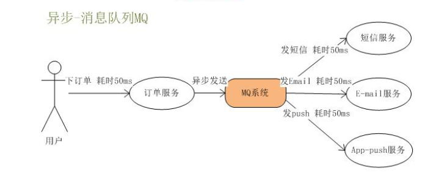
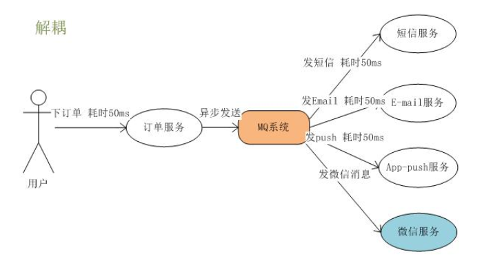
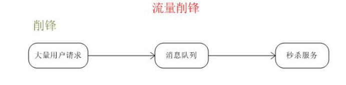
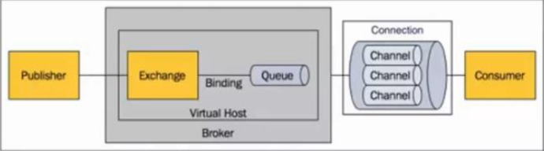
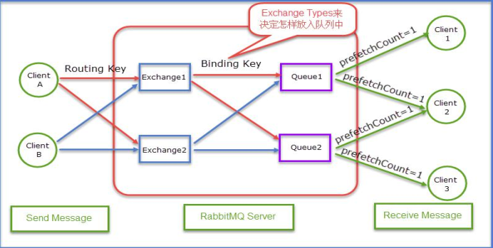
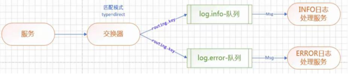
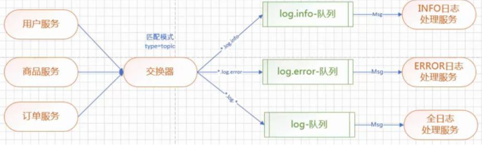

# RabbitMQ学习笔记

## 一、什么是RabbitMQ？

RabbitMQ是一套开源的消息队列服务软件，是由 LShift 提供的一个 AMQP（Advanced Message Queuing Protocol ）的开源实现，由以高性能、健壮以及可伸缩性出名的 Erlang 写成。

## 二、安装RabbitMQ

### 1、安装Erlang

#### 1.1什么是Erlang？

Erlang是一种通用的面向并发的编程语言，它由瑞典电信设备制造商爱立信所辖的CS-Lab开发，目的是创造一种可以应对大规模并发活动的编程语言和运行环境。

#### 1.2Erlang安装步骤

##### 1.2.1安装命令

```shell
wget https://packages.erlang-solutions.com/erlang-solutions-1.0-1.noarch.rpm
```

```shell
rpm -Uvh erlang-solutions-1.0-1.noarch.rpm
```

```shell
yum install erlang
```

### 2、安装RabbitMQ Server

```shell
wget http://www.rabbitmq.com/releases/rabbitmq-server/v3.5.1/rabbitmq-server-3.5.1-1.noarch.rpm
```

```shell
rpm --import http://www.rabbitmq.com/rabbitmq-signing-key-public.asc
```

```shell
yum install rabbitmq-server-3.5.1-1.noarch.rpm
```

### 3、启动RabbitMQ

1、配置为守护进程随系统自动启动，root权限下执行:

```shell
chkconfig rabbitmq-server on
```

2、启动rabbitMQ服务

```shell
#启动
systemctl start rabbitmq-server

#查看RabbitMQ状态
systemctl status rabbitmq-server

#重启
systemctl restart rabbitmq-server

#关闭
systemctl stop rabbitmq-server
```

### 4、安装Web管理界面插件

安装命令：

```shell
rabbitmq-plugins enable rabbitmq_management
```

安装成功提示：

```markdown
The following plugins have been enabled:
	  mochiweb
	  webmachine
	  rabbitmq_web_dispatch
	  amqp_client
	  rabbitmq_management_agent
	  rabbitmq_management
	Plugin configuration has changed. Restart RabbitMQ for changes to take effect.
```

### 5、设置RabbitMQ远程ip登录

这里我们创建一个账号名为yyh，密码为123456的管理员用户，并支持远程ip访问。

#### 5.1、创建账号

```shell
rabbitmqctl add_user yyh 123456
```

#### 5.2、设置用户角色

```shell
rabbitmqctl  set_user_tags  yyh  administrator
```

#### 5.3、设置用户权限

```shell
rabbitmqctl set_permissions -p "/" yyh ".*" ".*" ".*"
```

#### 5.4、设置完成后可以查看当前用户和角色

```shell
rabbitmqctl list_users
```

### 6、远程访问RabbitMQ

浏览器中输入：

```
http://serverip:15672
```

其中serverip是RabbitMQ-Server所在主机的ip

## 三、为什么要使用 RabbitMQ？ 他解决了什么问题？  

### 1、同步变异步



### 2、解耦



### 3、流量削峰



## 四、RabbitMQ 的入门  

### 1、搭建项目环境

#### 1、添加RabbitMQ坐标

```xml
<dependency>
    <groupId>org.springframework.boot</groupId>
    <artifactId>spring-boot-starter-amqp</artifactId>
</dependency>
```

#### 2、修改全局配置文件， 添加 RabbitMQ 相关的配置  

```properties
spring.application.name=springcloud-mq
spring.rabbitmq.host=192.168.40.133
spring.rabbitmq.port=5672
spring.rabbitmq.username=yyh
spring.rabbitmq.password=123456
```

### 2、编码

#### 1、创建队列

```java
@Configuration
public class QueueConfig {

    @Bean
    public Queue createQueue(){
        return new Queue("hello-queue");
    }
}
```

#### 2、创建Provider

```java
@Component
public class Sender {
    @Autowired
    private AmqpTemplate rabbitAmqpTemplate;

    public void send(String msg){
        //向消息队列发送消息
        // 参数一： 队列的名称
        //参数二： 消息
        this.rabbitAmqpTemplate.convertAndSend("hello-queue", msg);
    }
}
```

#### 3、创建Consumer

```java
@Component
public class Receiver {
    //采用消息队列监听机制
    @RabbitListener(queues="hello-queue")
    public void process(String msg){
        System.out.println("receiver: "+msg);
    }
}
```

#### 4、创建启动类

```java
@SpringBootApplication
public class SpringbootMqApplication {

    public static void main(String[] args) {
        SpringApplication.run(SpringbootMqApplication.class, args);
    }

}
```

#### 5、测试

```java
@RunWith(SpringRunner.class)
@SpringBootTest(classes=SpringbootMqApplication.class)
class SpringbootMqApplicationTests {

    @Autowired
    private Sender sender;
    /*
     * 测试消息队列
     */
    @Test
    public void test1(){
        this.sender.send("Hello RabbitMQ");
    }

}

```

## 五、RabbitMQ原理

### 5.1、RabbitMQ原理图





### 5.2、名词解释

#### 1、Message

指消息，消息是不具名的， 它由消息头消息体组成。 消息体是不透明的， 而消息头则由 一系列可选属性组成， 这些属性包括： routing-key(路由键)、 priority(相对于其他消息的优先 权)、 delivery-mode(指出消息可能持久性存储)等。

#### 2、Publisher

消息的生产者。 也是一个向交换器发布消息的客户端应用程序。

#### 3、Consumer

消息的消费者。 表示一个从消息队列中取得消息的客户端应用程序。

#### 4、Exchange

交换器。 用来接收生产者发送的消息并将这些消息路由给服务器中的队列。 

三种常用的交换器类型 

1、direct(发布与订阅 完全匹配)

2、fanout(广播) 

3、topic(主题， 规则匹配)

#### 5、Binding

绑定。 用于消息队列和交换器之间的关联。 一个绑定就是基于路由键将交换器和消息 队列连接起来的路由规则， 所以可以将交换器理解成一个由绑定构成的路由表。

#### 6、Queue

消息队列。 用来保存消息直到发送给消费者。 它是消息的容器， 也是消息的终点。 一 个消息可投入一个或多个队列。 消息一直在队列里面， 等待消费者链接到这个队列将其取 走。

#### 7、Routing-key

路由键。 RabbitMQ 决定消息该投递到哪个队列的规则。

队列通过路由键绑定到交换器。 

消息发送到 MQ 服务器时， 消息将拥有一个路由键， 即便是空的， RabbitMQ 也会将其 和绑定使用的路由键进行匹配。 

如果相匹配， 消息将会投递到该队列。 

如果不匹配， 消息将会进入黑洞。

#### 8、Connection

链接。 指 rabbit 服务器和服务建立的 TCP 链接。

#### 9、Channel

信道。是 TCP 里面的虚拟链接。 例如： 电缆相当于 TCP， 信道是 一个独立光纤束， 一条 TCP 连接上创建多条信道是没有问题的。 

TCP 一旦打开， 就会创建 AMQP 信道。 

无论是发布消息、 接收消息、 订阅队列， 这些动作都是通过信道完成的。

#### 10、Virtual Host

虚拟主机。 表示一批交换器， 消息队列和相关对象。 虚拟主机是共享相同的身份认证 和加密环境的独立服务器域。 每个 Virtual Host 本质上就是一个 mini 版的 RabbitMQ 服务器， 拥有自己的队列、交换器、绑定和权限机制。 Virtual Host 是 AMQP 概念的基础， 必须在链接时指定， RabbitMQ 默认的 vhost 是/

#### 11、Borker

表示消息队列服务器实体。

#### 12、交换器和队列的关系

交换器是通过路由键和队列绑定在一起的， 如果消息拥有的路由键跟队列和交换器的 路由键匹配， 那么消息就会被路由到该绑定的队列中。 也就是说， 消息到队列的过程中， 消息首先会经过交换器， 接下来交换器在通过路由 键匹配分发消息到具体的队列中。 路由键可以理解为匹配的规则。

#### 13、RabbitMQ 为什么需要信道？ 为什么不是 TCP 直接通信？

1、TCP 的创建和销毁开销特别大。 创建需要 3 次握手， 销毁需要 4 次分手。

2、如果不用信道， 那应用程序就会以 TCP 链接 RabbitMQ， 高峰时每秒成千上万条链接会造成资源巨大的浪费， 而且操作系统每秒处理 TCP 链接数也是有限制的，必定造成性能瓶颈。

3、信道的原理是一条线程一条通道，多条线程多条通道同用一条 TCP 链接。一条 TCP 链接可以容纳无限的信道，即使每秒成千上万的请求也不会成为性能的瓶颈。

## 六、RabbitMQ交换器

### 1、Direct 交换器

#### 1、需求

业务场景：系统日志处理

1、微服务产生的日志，交给日志服务器处理

2、日志处理服务器有4个服务，分别为DEBUG、INFO、WARN、ERROR

3.服务直接的通信采用direct（发布与订阅完全匹配)  



#### 2、编码实现

##### 1、编写Consumer

###### 1、修改 Consumer 的全局配置文件  

```properties
spring.application.name=springcloud-mq
spring.rabbitmq.host=192.168.40.133
spring.rabbitmq.port=5672
spring.rabbitmq.username=yyh
spring.rabbitmq.password=123456
#设置交换器的名称
mq.config.exchange=log.direct
#info 队列名称
mq.config.queue.info=log.info
#info 路由键
mq.config.queue.info.routing.key=log.info.routing.key
#error 队列名称
mq.config.queue.error=log.error
#error 路由键
mq.config.queue.error.routing.key=log.error.routing.key

```

###### 2、InfoReceiver

```java
/**
 * 消息接收者
 * @author Administrator
 * @RabbitListener bindings:绑定队列
 * @QueueBinding value:绑定队列的名称
 * exchange:配置交换器
 * @Queue value:配置队列名称
 * autoDelete:是否是一个可删除的临时队列
 * @Exchange value:为交换器起个名称
 * type:指定具体的交换器类型
 */
@Component
@RabbitListener(
        bindings=@QueueBinding(
                value=@Queue(value="${mq.config.queue.info}",autoDelete="true"),
                exchange=@Exchange(value="${mq.config.exchange}",type= ExchangeTypes.DIRECT),
                key="${mq.config.queue.info.routing.key}"
        )
)
public class InfoReceiver {
    @RabbitHandler
    public void process(String msg){
        System.out.println("Info...receiver: "+msg);
    }
}

```

###### 3、ErrorReceiver

```java
/**
 * 消息接收者
 * @author Administrator
 * @RabbitListener bindings:绑定队列
 * @QueueBinding value:绑定队列的名称
 * exchange:配置交换器
 * @Queue value:配置队列名称
 * autoDelete:是否是一个可删除的临时队列
 * @Exchange value:为交换器起个名称
 * type:指定具体的交换器类型
 */
@Component
@RabbitListener(bindings=@QueueBinding(
        value=@Queue(value="${mq.config.queue.error}",autoDelete="true"),
                exchange=@Exchange(value="${mq.config.exchange}",type= ExchangeTypes.DIRECT),
                key="${mq.config.queue.error.routing.key}"
        )
)
public class ErrorReceiver {
    @RabbitHandler
    public void process(String msg){
        System.out.println("Error...receiver: "+msg);
    }
}

```

##### 2、编写Provider

###### 1、修改 Provider 的全局配置文件  

```properties
spring.application.name=springcloud-mq
spring.rabbitmq.host=192.168.40.133
spring.rabbitmq.port=5672
spring.rabbitmq.username=yyh
spring.rabbitmq.password=123456
#设置交换器的名称
mq.config.exchange=log.direct
#info 路由键
mq.config.queue.info.routing.key=log.info.routing.key
#error 路由键
mq.config.queue.error.routing.key=log.error.routing.key

```

###### 2、Sender

```java
@Component
public class Sender {
    @Autowired
    private AmqpTemplate rabbitAmqpTemplate;
    //exchange 交换器名称
    @Value("${mq.config.exchange}")
    private String exchange;
    //routingkey 路由键
    @Value("${mq.config.queue.error.routing.key}")
    private String routingkey;

    public void send(String msg){
        //向消息队列发送消息
        //参数一： 交换器名称。
        //参数二： 路由键
        //参数三： 消息
        this.rabbitAmqpTemplate.convertAndSend(this.exchange, this.routingkey, msg);
    }
}

```

##### 3、测试

```java
@RunWith(SpringRunner.class)
@SpringBootTest(classes = SpringbootMqProviderApplication.class)
class SpringbootMqProviderApplicationTests {

    @Autowired
    private Sender sender;

    @Test
    void test() throws InterruptedException {
        while(true){
            Thread.sleep(1000);
            this.sender.send("Hello RabbitMQ");
        }
    }

}

```

### 2、Topic交换器

#### 1、需求



#### 2、编码实现

##### 1、编写Provider

###### 1、修改Provider全局配置文件

```properties
spring.application.name=springcloud-mq
spring.rabbitmq.host=192.168.40.133
spring.rabbitmq.port=5672
spring.rabbitmq.username=yyh
spring.rabbitmq.password=123456
#设置交换器的名称
mq.config.exchange=log.topic
```

###### 2、UserSender

```java
@Component
public class UserSender {
    @Autowired
    private AmqpTemplate rabbitAmqpTemplate;
    //exchange 交换器名称
    @Value("${mq.config.exchange}")
    private String exchange;

    public void send(String msg){
        //向消息队列发送消息
        //参数一： 交换器名称
        //参数二： 路由键
        //参数三： 消息
        this.rabbitAmqpTemplate.convertAndSend(this.exchange,"user.log.debug", "user.log.debug..."+msg);
        this.rabbitAmqpTemplate.convertAndSend(this.exchange,"user.log.info", "user.log.info..."+msg);
        this.rabbitAmqpTemplate.convertAndSend(this.exchange,"user.log.warn","user.log.warn..."+msg);
        this.rabbitAmqpTemplate.convertAndSend(this.exchange,"user.log.error", "user.log.error..."+msg);
    }
}

```

###### 3、ProductSender

```java
@Component
public class ProductSender {
    @Autowired
    private AmqpTemplate rabbitAmqpTemplate;
    //exchange 交换器名称
    @Value("${mq.config.exchange}")
    private String exchange;
    /*
     * 发送消息的方法
     */
    public void send(String msg){
        //向消息队列发送消息
        //参数一： 交换器名称。
        //参数二： 路由键
        //参数三： 消息
        this.rabbitAmqpTemplate.convertAndSend(this.exchange,"product.log.debug", "product.log.debug..."+msg);
        this.rabbitAmqpTemplate.convertAndSend(this.exchange,"product.log.info", "product.log.info..."+msg);
        this.rabbitAmqpTemplate.convertAndSend(this.exchange,"product.log.warn","product.log.warn..."+msg);
        this.rabbitAmqpTemplate.convertAndSend(this.exchange,"product.log.error", "product.log.error..."+msg);
    }
}

```

###### 4、OrderSender

```java
@Component
public class OrderSender {
    @Autowired
    private AmqpTemplate rabbitAmqpTemplate;
    //exchange 交换器名称
    @Value("${mq.config.exchange}")
    private String exchange;
    /*
     * 发送消息的方法
     */
    public void send(String msg){
        //向消息队列发送消息
        //参数一： 交换器名称。
        //参数二： 路由键
        //参数三： 消息
        this.rabbitAmqpTemplate.convertAndSend(this.exchange,"order.log.debug", "order.log.debug..."+msg);
        this.rabbitAmqpTemplate.convertAndSend(this.exchange,"order.log.info", "order.log.info..."+msg);
        this.rabbitAmqpTemplate.convertAndSend(this.exchange,"order.log.warn","order.log.warn..."+msg);
        this.rabbitAmqpTemplate.convertAndSend(this.exchange,"order.log.error", "order.log.error..."+msg);
    }
}

```

##### 2、编写Consumer

###### 1、修改Consumer全局配置文件

```properties
spring.application.name=springcloud-mq
spring.rabbitmq.host=192.168.40.133
  spring.rabbitmq.port=5672
spring.rabbitmq.username=yyh
spring.rabbitmq.password=123456
#设置交换器的名称
mq.config.exchange=log.topic
#info 队列名称
mq.config.queue.info=log.info
#error 队列名称
mq.config.queue.error=log.error
#log 队列名称
mq.config.queue.logs=log.all
```

###### 2、InfoReceiver

```java
/**
 * 消息接收者
 * @author Administrator
 * @RabbitListener bindings:绑定队列
 * @QueueBinding value:绑定队列的名称
 * exchange:配置交换器
 **
 @Queue value:配置队列名称
  * autoDelete:是否是一个可删除的临时队列
 **
 @Exchange value:为交换器起个名称
  * type:指定具体的交换器类型
 */
@Component
@RabbitListener(
    bindings=@QueueBinding(
        value=@Queue(value="${mq.config.queue.info}",autoDelete="true"),
        exchange=@Exchange(value="${mq.config.exchange}",type=ExchangeTypes.TOPIC),
        key="*.log.info"
    )
)
public class InfoReceiver {
    /**
     * 接收消息的方法。 采用消息队列监听机制
     * @param msg
     */
    @RabbitHandler
    public void process(String msg){
        System.out.println("...Info...receiver: "+msg);
    }
}
```

###### 3、ErrorReceiver

```java
/**
 * 消息接收者
 * @author Administrator
 * @RabbitListener bindings:绑定队列
 * @QueueBinding value:绑定队列的名称
 * exchange:配置交换器
 **
 @Queue value:配置队列名称
  * autoDelete:是否是一个可删除的临时队列
 **
 @Exchange value:为交换器起个名称
  * type:指定具体的交换器类型
 */
@Component
@RabbitListener(
    bindings=@QueueBinding(
        value=@Queue(value="${mq.config.queue.error}",autoDelete="true"),
        exchange=@Exchange(value="${mq.config.exchange}",type=ExchangeTypes.TOPIC),
        key="*.log.error"
    )
)
public class ErrorReceiver {
    /**
    * 接收消息的方法。 采用消息队列监听机制
    * @param msg
    */
    @RabbitHandler
    public void process(String msg){
        System.out.println("...Error...receiver: "+msg);
    }
}
```

###### 4、LogsReceiver

```java
**
 * 消息接收者
 * @author Administrator
 * @RabbitListener bindings:绑定队列
 * @QueueBinding value:绑定队列的名称
 * exchange:配置交换器
 **
 @Queue value:配置队列名称
  * autoDelete:是否是一个可删除的临时队列
 **
 @Exchange value:为交换器起个名称
  * type:指定具体的交换器类型
 */
@Component
@RabbitListener(
    bindings=@QueueBinding(
        value=@Queue(value="${mq.config.queue.logs}",autoDelete="true"),
        exchange=@Exchange(value="${mq.config.exchange}",type= ExchangeTypes.TOPIC),
        key="*.log.*"
    )
)
public class LogsReceiver {
    /**
     * 接收消息的方法。 采用消息队列监听机制
     * @param msg
     */
    @RabbitHandler
    public void process(String msg){
        System.out.println("...All...receiver: "+msg);
    }
}

```

##### 3、测试

```java
@RunWith(SpringRunner.class)
@SpringBootTest(classes=SpringbootMqProviderApplication.class)
public class SpringbootMqProviderApplicationTests {
    @Autowired
    private UserSender usersender;
    @Autowired
    private ProductSender productsender;
    @Autowired
    private OrderSender ordersender;
    /*
     * 测试消息队列
     */
    @Test
    public void test(){
        this.usersender.send("UserSender...");
        this.productsender.send("ProductSender...");
        this.ordersender.send("OrderSender...");
    }
}
```

