# SQL学习笔记

## 一、SQL语言介绍

### 一、什么是SQL语言

1、SQL的全称是结构化查询语言(Structured Query Language)

2、SQL是最重要的关系数据库操作语言，是所有关系数据库管理系统的标准语言

3、许多数据库厂商在使用SQL的同时，都对SQL进行了扩展，比如ORACLE的PL/SQL语言，MS的SQL-Server的T-SQL语言

4、SQL语言是一种非过程化语言，只需要提出“做什么”，而不需要指明“怎么做”

### 二、SQL可以做什么

1、数据库数据的增删改查操作(CURD)

2、数据库对象的创建、修改和删除操作

3、用户权限/角色的授予和取消

4、事务控制

## 二、SQL语言分类

### 一、DQL(数据查询语言)

| SQL命令 | 作用                           |
| ------- | ------------------------------ |
| select  | 从一个或多个表或视图中查询数据 |

### 二、DML(数据操作语言)

| SQL命令 | 作用                           |
| ------- | ------------------------------ |
| insert  | 向表或视图中加入新数据行       |
| update  | 修改表或视图中已有数据行的列值 |
| delete  | 从表或视图中删除数据行         |

### 三、DDL(数据定义语言)

| SQL命令 | 作用                                                     |
| ------- | -------------------------------------------------------- |
| create  | 创建方案对象及其他数据库结构，包括数据库自身及数据库用户 |
| alter   | 修改方案对象及其他数据库结构，包括数据库自身及数据库用户 |
| drop    | 移除方案对象及其他数据库结构，包括数据库自身及数据库用户 |
| comment | 向数据字典中添加注释                                     |

### 四、DCL(数据控制语言)

| SQL命令 | 作用           |
| ------- | -------------- |
| grant   | 授予权限及角色 |
| revoke  | 收回权限及角色 |

### 五、TCL(事务控制语言)

| SQL命令         | 作用                                                 |
| --------------- | ---------------------------------------------------- |
| SAVEPOINT       | 设置保存点以标识回滚位置                             |
| ROLLBACK        | 还原事务对数据的修改，可还原到事务开始处或任意保存点 |
| SET TRANSACTION | 设置事务的属性                                       |
| COMMIT          | 将事务对数据的修改永久地保存到数据库                 |

## 三、SQL标准发展

| 标准     | 发布时间 |
| -------- | -------- |
| SQL-86   | 1986     |
| SQL-89   | 1989     |
| SQL-92   | 1992     |
| SQL:1999 | 1999     |
| SQL:2003 | 2003     |
| SQL:2008 | 2008     |
| SQL:2011 | 2011     |

​	1974年，IBM的Ray Boyce和Don Chamberlin将E.F.Codd关系数据库的12条准则的数学定义以简单的关键字语法表现出来，里程碑式地提出了结构化查询语言(Structured Query Language，SQL)。

​	1989年，ANSI把SQL作为关系数据库语言的美国标准，同年公布了标准SQL文本。基本SQL定义是ANSIX3135-89，“Database Language - SQL with Integrity Enhancement”[ANS89]，一般叫做SQL-89标准（也称为SQL1）。SQL-89定义了模式、数据操作和事务处理。SQL-89和随后的ANSIX3168-1989，“Database Language-Embedded SQL”构成了第一代SQL标准。

​	1992年，ISO 和 IEC 发布了 SQL 的国际标准，称为 SQL-92。ANSI 随之发布的相应标准是 ANSI SQL-92。ANSI SQL-92 有时被称为 ANSI SQL。ANSIX3135-1992[ANS92]描述了一种增强功能的SQL，现在叫做SQL-92标准（也称为SQL2）。SQL-92包括模式操作，动态创建和SQL语句动态执行、网络环境支持等增强特性。SQL Server 使用 ANSI SQL-92 的扩展集，称为 T-SQL，其遵循 ANSI 制定的 SQL-92 标准。

​	在完成SQL-92标准后，ANSI和ISO即开始合作在1999年发布了SQL-99标准（也称为SQL3）。SQL3的主要特点在于抽象数据类型的支持，为新一代对象关系数据库提供了标准。

## 四、关系数据库基本概念

1、关系：整个二维表

2、关系名：表格名称

3、元组：行数据（记录）

4、属性：列数据（字段）

5、属性名：列名称（字段名）

6、主键：唯一确定元组的属性组（关键字）

7、域：属性的取值范围


## 五、SQL语句

### 一、select语句

#### 一、select子句

##### 1、最简单的查询方式

```sql
1、select * from emp;
```

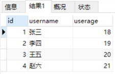

```sql
2、select id,username from emp;
```


##### 2、使用算术表达式

##### 3、使用字段别名

```sql
1、select id as "员工编号",username "员工姓名" from emp;
```

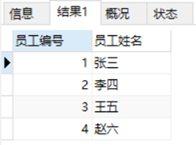

字段别名:

1、重命名查询结果中的字段，以增强可读性

2、别名如果含有空格或其他特殊字符或大小写敏感，需用双引号引起来

3、AS可以省略

##### 4、去除重复行

缺写情况下，查询结果中包含所有符合条件的记录行，包括重复行

```sql
1、select username from emp;
```

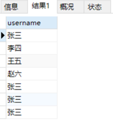

使用DISTINCT关键字可从查询结果中清除重复行

```sql
2、select distinct username from emp;
```


**注**：DISTINCT的作用范围是后面所有字段的组合

#### 二、order by子句

使用order by 子句对查询结果进行排序

排序方式包括升序（asc，缺写）和降序（desc）两种：

```sql
1、select username,userage from emp order by userage;
```


```sql
2、select username,userage from emp order by userage desc;
```


按多字段排序

```sql
1、select username,userage from emp order by id,userage;
```


#### 三、where子句

##### 一、指定查询条件使用where子句

```sql
1、	select * from emp where id=1;
```


```sql
2、	select * from emp where username = '张三';
```


**注**：

字符串和日期值要用单引号扩起来         

字符串大小写敏感

日期值格式敏感，缺写的日期格式是'DD-MON-RR‘

##### 二、查询条件中可以使用比较运算符

```sql
1、	select * from emp where userage > 20;
```


```sql
2、select * from emp where userage <> 20;
```


```sql
3、	select * from emp where userage between 19 and 21;
```


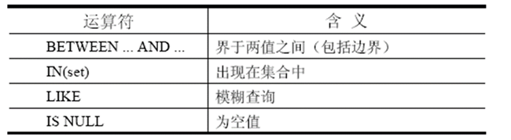

##### 三、使用LIKE运算符执行模糊查询（通配查询）

% 表示零或多个字符    _ 表示一个字符

对于特殊符号可使用ESCAPE 标识符来查找

```sql
1、	select * from emp where username like '李%';
```


查询条件中可以使用逻辑运算符

```sql
2、select * from emp where userage > 19 and username = '张三';
```


SQL优化问题：

AND: 把检索结果较少的条件放到后面

OR: 把检索结果较多的条件放到后面

**注**：共计四种运算符：算术>连接>比较>逻辑

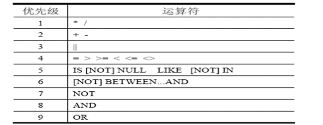

#### 四、使用函数

作用：

1、使用函数可以大大提高SELECT语句操作数据库的能力

2、它给数据的转换和处理提供了方便

3、函数只是将取出的数据进行处理，不会改变数据库中的值

##### 一、字符函数

| 函 数                                | 功 能      | 示 例                               | 结 果          |
| :----------------------------------- | ---------- | ----------------------------------- | :------------- |
| INITCAP (char)                       | 首字母大写 | initcap ('hello')                   | Hello          |
| LOWER (char)                         | 转换为小写 | lower ('FUN')                       | fun            |
| LTRIM (char, set)                    | 左剪裁     | ltrim ('xyzadams', 'xyz')           | adams          |
| REPLACE(char,search_str,replace_str) | 字符串替换 | replace ('jack and jue', 'j', 'bl') | black and blue |
| SUBSTR (char, pos, len)              | 取子字符串 | substr ('abcdefg',3,2)              | cd             |

##### 二、数值函数

| 函 数      | 功 能    | 示 例            | 结 果      |
| :--------- | -------- | ---------------- | ---------- |
| ABS(n)     | 取绝对值 | abs(-15)         | 15         |
| CEIL(n )   | 向上取整 | ceil(44.778)     | 45         |
| SIN(n)     | 正弦     | sin(1.571)       | .999999979 |
| MOD(m,n)   | 取余数   | mod(10,3)        | 1          |
| ROUND(m,n) | 四舍五入 | round(100.256,2) | 100.26     |

##### 三、日期函数

| 函 数          | 功 能                            | 示 例                                 | 结 果      |
| -------------- | -------------------------------- | ------------------------------------- | :--------- |
| MONTHS_BETWEEN | 返回两个日期间的月份             | months_between ('04-11-05','11-1-01') | 57.7741935 |
| NEXT_DAY       | 返回指定日期后的星期对应的新日期 | next_day('06-2-03','星期一')          | 10-2-03    |

##### 四、特殊函数

1、 count()函数

(1) count(*)返回组中总记录数目；

(2) count(exp)返回表达式exp值非空的记录数目；

(3) count(distinct(exp))返回表达式exp值不重复的、非空的记录数目。

```sql
select count(*) from emp;
```


#### 五、group by子句

GROUP BY 子句将表中数据分成若干小组

```sql
select username, avg(userage) from emp group by username;
```


**注**：

1、出现在SELECT列表中的字段，如果不是包含在多行函数中，那么该字段必须同时在GROUP BY子句中出现

2、包含在GROUP BY子句中的字段则不必须出现在SELECT列表中     

3、如果没有GROUP BY子句，SELECT列表中不允许出现字段（单行函数）与多行函数混用的情况

4、不允许在WHERE 子句中使用多行函数

#### 六、having子句

Having子句对分组查询的结果进行过滤

```sql
select username, min(userage) from emp group by username having min(userage<21);
```

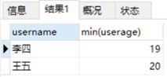

**注**：

1、having从句过滤分组后的结果，它只能出现在group by从句之后，而where从句要出现在group by从句之前。

2、where过滤行，having过滤分组。having支持所有where操作符。

### 二、insert语句

往表中插入数据的语句是insert语句，方式有两种，一种是记录值的插入，一种是查询结果的插入

一次插入操作只插入一行

1、可以添加所有列，此处插入的元组中列的个数、顺序与emp的结构完全一致，因此表名之后的列名可以省略不写

```sql
insert into emp values (default,'小叶',20);
```


2、 也可以只添加部分列

```sql
insert into emp(id,userage) values (default,22);
```


表中数据：


**注**：

要求省略的列必须满足下面的条件：

1、该列定义为允许Null值。

2、在表定义中给出默认值，这表示如果不给出值，将使用默认值。

### 三、update语句

修改基本表中元组的某些列的语句是update语句

```sql
update emp set userage=18 where username='小叶';
```


其语义是：修改基本表中满足条件表达式的那些元组的列值，需修改的列值在set子句中指出。

### 四、delete语句

从基本表中删除元组的语句是delete语句

```sql
delete from emp where username='小叶';
```


## 六、多表连接查询

概念：根据两个表或多个表的列之间的关系，从这些表中查询数据。

目的：实现多个表查询操作。

emp_info表：

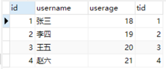

Emp_salary表：

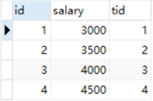

### 一、交叉连接

1、CROSS JOIN产生了一个笛卡尔集，其效果等同于在两个表进行连接时未使用WHERE子句限定连接条件;

2、可以使用where条件从笛卡尔集中选出满足条件的记录。

```sql
select username,userage,emp_salary.salary from emp_info cross join emp_salary where emp_info.tid = emp_salary.tid;
```


### 二、自然连接

1、NATURAL JOIN基于两个表中的全部同名列建立连接

2、从两个表中选出同名列的值均对应相等的所有行

3、如果两个表中同名列的数据类型不同，则出错

4、不允许在参照列上使用表名或者别名作为前缀

5、自然连接的结果不保留重复的属性

```sql
select username,userage,salary from emp_info natural join emp_salary;
```

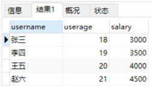

### 三、Using连接

1、如果不希望参照被连接表的所有同名列进行等值连接，自然连接将无法满足要求，可以在连接时使用USING子句来设置用于等值连接的列（参照列）名。

2、using子句引用的列在sql任何地方不能使用表名或者别名做前缀

```sql
select ei.username,ei.userage,tid,es.salary from emp_info ei join emp_salary es using(tid);
```

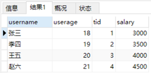

### 四、On连接

1、自然连接的条件是基于表中所有同名列的等值连接

2、为了设置任意的连接条件或者指定连接的列，需要使用ON子句

3、连接条件与其它的查询条件分开书写

4、使用ON 子句使查询语句更容易理解

```sql
select username,userage,salary from emp_info join emp_salary on emp_info.tid = emp_salary.tid;
```

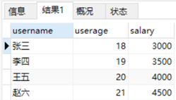

### 五、外连接

#### 一、左外联接

两个表在连接过程中除返回满足连接条件的行以外，还返回左表中不满足条件的行，这种连接称为左外联接。

```sql
select username,userage,salary from emp_info left join emp_salary on emp_info.tid = emp_salary.tid;
```

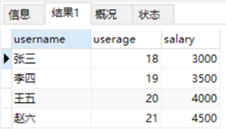

#### 二、右外联接

两个表在连接过程中除返回满足连接条件的行以外，还返回右表中不满足条件的行，这种连接称为右外联接。

```sql
select username,userage,salary from emp_info right join emp_salary on emp_info.tid = emp_salary.tid;
```


#### 三、满外联接

两个表在连接过程中除返回满足连接条件的行以外，还返回两个表中不满足条件的所有行，这种连接称为满外联接。

```sql
select username,userage,salary from emp_info full join emp_salary using(tid);
```


### 六、自连接

将表连接到自身时的连接称为自连接。

```sql
select e.id,m.username,m.userage from emp_info e left join emp_info m on e.id=m.id;
```

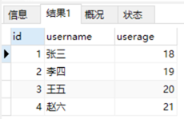

## 七、子查询

嵌套在其他查询中的查询叫做子查询

1、如查询表中比“李四“年龄大的记录，

```sql
select * from emp_info where userage > (select userage from emp_info where username = '李四');
```


**注**：

1、在查询是基于未知值时应考虑使用子查询

2、子查询必须包含在括号内   

3、建议将子查询放在比较运算符的右侧，以增强可读性。

4、除非进行Top-N 分析，否则不要在子查询中使用ORDER BY 子句。

5、如果子查询返回单行结果，则为单行子查询，可以在主查询中对其使用相应的单行记录比较运算符

6、如果子查询返回多行结果，则为多行子查询，此时不允许对其使用单行记录比较运算符

### 一、单行子查询

单行子查询只返回一行记录，对单行子查询可使用单行记录比较运算符(<、> 、= 、>=、 <= 、<>)

### 二、多行子查询

多行子查询返回多行记录，对多行子查询只能使用多行记录比较运算符，如：

1、ALL 和子查询返回的所有值比较

2、ANY 和子查询返回的任意一个值比较

3、IN 等于列表中的任何一个